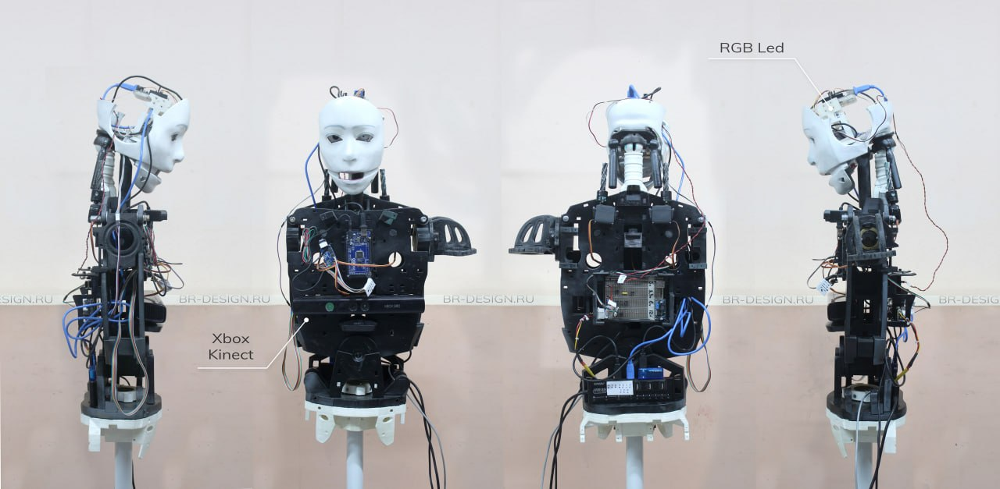
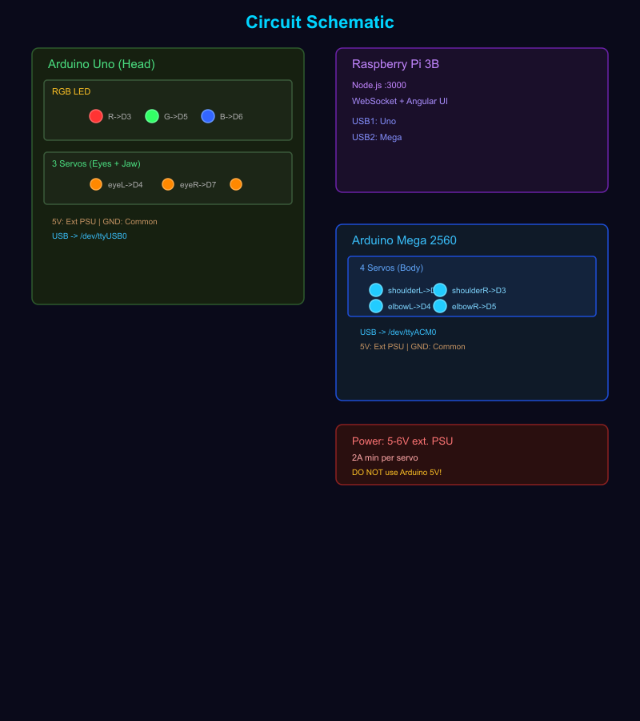
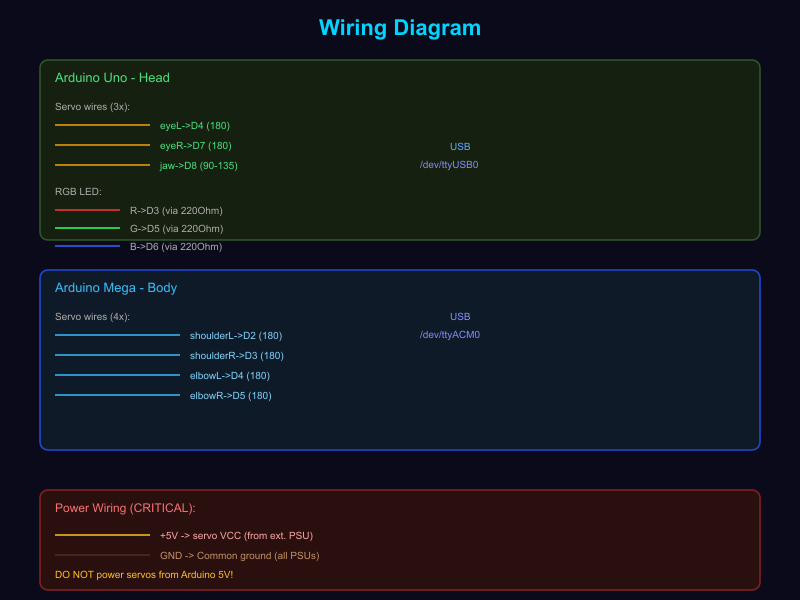
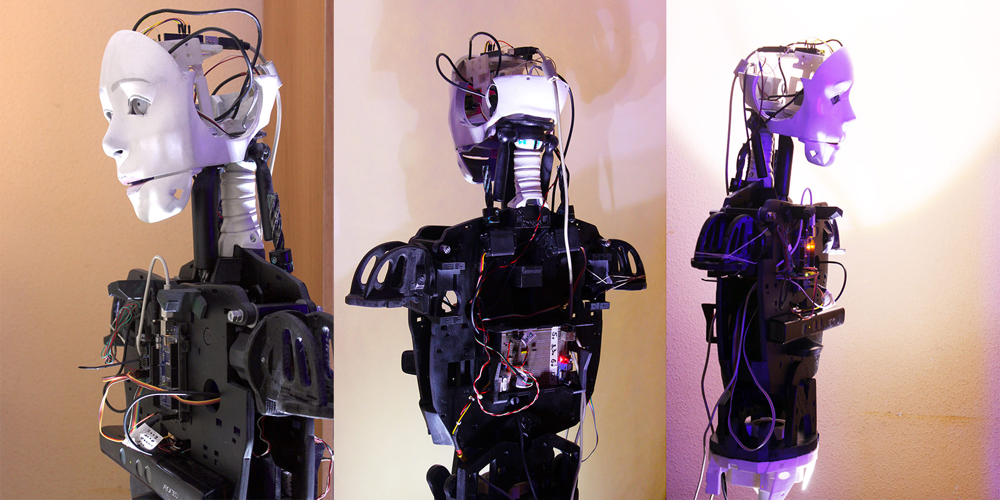

# 🤖 Robot Catty

<div align="center">



```
  ╔═══════════════════════════════════════════════════════════╗
  ║  ██████╗  ██████╗ ██████╗  ██████╗ ████████╗           ║
  ║  ██╔══██╗██╔═══██╗██╔══██╗██╔═══██╗╚══██╔══╝           ║
  ║  ██████╔╝██║   ██║██████╔╝██║   ██║   ██║              ║
  ║  ██╔══██╗██║   ██║██╔══██╗██║   ██║   ██║              ║
  ║  ██║  ██║╚██████╔╝██████╔╝╚██████╔╝   ██║              ║
  ║  ╚═╝  ╚═╝ ╚═════╝ ╚═════╝  ╚═════╝    ╚═╝              ║
  ║                                                         ║
  ║   🐱 Raspberry Pi + Arduino Robot                       ║
  ║   3 серво (глаза + челюсть) + RGB LED + Web UI         ║
  ╚═══════════════════════════════════════════════════════════╝
```

[](https://opensource.org/licenses/MIT)
[](https://www.arduino.cc/)

</div>

Raspberry Pi + Arduino робот с веб-интерфейсом управления.

## ⚡ Схема подключения

### Превью

| Схема подключения | Проводка |
|:---:|:---:|
|  |  |

### Интерактивные схемы

- 🔗 [Полная интерактивная схема](docs/robot-catty-circuit.html) — кликабельная SVG с подробными подписями
- 📄 [Wiring документация](docs/wiring.md) — текстовое описание подключения

### Краткое описание

```
Arduino Uno (Голова)  ←USB→  Raspberry Pi 3B  ←USB→  Arduino Mega (Тело)
  D3→RGB R  (220Ω)              Node.js :3000            D2→Shoulder L
  D5→RGB G  (220Ω)              WebSocket               D3→Shoulder R
  D6→RGB B  (220Ω)              Angular UI              D4→Elbow L
  D4→Servo L (глазо)                                    D5→Elbow R
  D7→Servo R (глазо)
  D8→Servo J (челюсть)

  ⚠️  НЕ питать сервоприводы от Arduino 5V!
  ⚠️  GND Arduino и внешнего блока питания соединить вместе!
```

### Распиновка сервоприводов

| Сервопривод | Пин | Направление | Центр |
|-------------|-----|-------------|-------|
| 👁️ Левый глаз | D4 | ↔ лево/право | 90° |
| 👁️ Правый глаз | D7 | ↔ лево/право | 90° |
| 🦷 Челюсть | D8 | ↕ открыть/закрыть | 90° (закрыта) |

## Архитектура

```
┌─────────────┐     USB      ┌──────────────┐
│             │──────────────│ Arduino Uno  │ Голова: 3 серво + RGB LED
│  Raspberry  │              │ (CH340)      │  • Левый глаз (D4)
│  Pi 3B      │              │              │  • Правый глаз (D7)
│             │              │              │  • Челюсть (D8)
│             │              └──────────────┘
│             │     USB      ┌──────────────┐
│  Node.js    │──────────────│ Arduino Mega │ Тело: 4 серво (+4 future)
│  Server     │              │ 2560 R3      │
│  :3000      │              └──────────────┘
│             │
│  Angular UI │◄── WebSocket ── Браузер
└─────────────┘
```

## Компоненты

| Компонент | Роль | Подключение |
|-----------|------|-------------|
| Raspberry Pi 3B | Контроллер, веб-сервер | Ethernet/WiFi |
| Arduino Uno (CH340) | Голова: 3 серво + RGB LED | USB → /dev/ttyUSB0 |
| Arduino Mega 2560 R3 | Тело: 4 серво | USB → /dev/ttyACM0 |
| RGB LED (4-pin) | Индикация глаз | Uno D3/D5/D6 |
| Сервоприводы (×7) | Движение | Uno D4,D7,D8 / Mega D2-D5 |

## Подключённые модули

### Веб-интерфейс — панель «Модули»

В UI есть отдельная панель «Подключённые модули», которая отображает все обнаруженные устройства на обеих Arduino платах:

| Плата | Модуль | Пин | Тип | Отображаемое значение |
|-------|--------|-----|-----|----------------------|
| Arduino Uno | RGB LED | D3/D5/D6 | rgb | HEX цвет или OFF |
| Arduino Uno | eyeL | D4 | servo | Угол (°) |
| Arduino Uno | eyeR | D7 | servo | Угол (°) |
| Arduino Uno | jaw | D8 | servo | Угол (°) |
| Arduino Mega | shoulderL | D2 | servo | Угол (°) |
| Arduino Mega | shoulderR | D3 | servo | Угол (°) |
| Arduino Mega | elbowL | D4 | servo | Угол (°) |
| Arduino Mega | elbowR | D5 | servo | Угол (°) |

Статус каждой платы индицируется точкой: 🟢 Online / 🔴 Offline.

## Структура проекта

```
robot-catty/
├── firmware/
│   ├── servo_head/servo_head.cpp    # Uno — голова (3 серво + RGB)
│   └── servo_body/servo_body.ino    # Mega — тело (4 серво)
├── server/
│   ├── package.json                 # Node.js зависимости
│   ├── server.js                    # Express + WebSocket сервер
│   ├── services/
│   │   ├── arduino.js               # Serial связь с Arduino
│   │   └── robot.js                 # Логика робота + анимации
│   └── public/
│       └── index.html               # Angular веб-интерфейс
├── config/
│   ├── arduino_config.md            # Настройки плат
│   └── servo_config.json            # Конфигурация серво (пины, лимиты)
├── docs/
│   ├── wiring.md                    # Схема подключения (полная)
│   └── wiring-3servo.md             # Схема 3 серво + RGB
├── scripts/
│   ├── rgb_bot.py                   # Telegram бот управления RGB
│   └── demo.py                      # Демо-режим (автозапуск)
├── remote/
│   └── rgb_led_remote.py            # Удалённое управление с Windows
├── ISSUES.md                        # Известные задачи и проблемы
├── CREATE_ISSUES.md                 # Шаблоны для GitHub Issues
└── README.md                        # Этот файл
```

## Сервоприводы

### Голова (Arduino Uno)

| Серво | Пин | Описание |
|-------|-----|----------|
| eyeL | D4 | Левый глаз |
| eyeR | D7 | Правый глаз |
| jaw | D8 | Челюсть |

### Тело (Arduino Mega 2560)

| Серво | Пин | Описание |
|-------|-----|----------|
| shoulderL | D2 | Левое плечо |
| shoulderR | D3 | Правое плечо |
| elbowL | D4 | Левый локоть |
| elbowR | D5 | Правый локоть |

### Будущее расширение (Mega)

| Серво | Пин | Описание |
|-------|-----|----------|
| shoulderL2 | D6 | Левое плечо 2 |
| shoulderR2 | D7 | Правое плечо 2 |
| elbowL2 | D8 | Левый локоть 2 |
| elbowR2 | D9 | Правый локоть 2 |

## RGB LED

4-pin RGB LED (общий катод):

| Цвет | Пин | Резистор |
|------|-----|----------|
| Red | D3 (PWM) | 220Ω |
| Green | D5 (PWM) | 220Ω |
| Blue | D6 (PWM) | 220Ω |
| GND | GND | — |

## Serial протокол (9600 baud)

### Arduino Uno (Голова)

| Команда | Описание | Пример |
|---------|----------|--------|
| `SERVO:<name>:<angle>` | Установить угол серво (0-180) | `SERVO:headRot:120` |
| `RGB:<r>,<g>,<b>` | Установить цвет (0-255) | `RGB:255,128,0` |
| `OFF` | Выключить RGB | `OFF` |
| `FADE:<r>,<g>,<b>` | Плавный переход к цвету | `FADE:0,0,255` |
| `BLINK` | Режим мигания | `BLINK` |
| `PRESET:<name>` | Готовый цвет | `PRESET:red` |
| `STATUS` | Текущее состояние | `STATUS` |

### Arduino Mega (Тело)

| Команда | Описание | Пример |
|---------|----------|--------|
| `SERVO:<name>:<angle>` | Установить угол серво (0-180) | `SERVO:shoulderL:120` |
| `CENTER` | Центрировать все серво | `CENTER` |
| `STATUS` | Текущее состояние | `STATUS` |

### Пресеты цветов

`red`, `green`, `blue`, `white`, `yellow`, `cyan`, `magenta`, `orange`, `pink`, `purple`

## Ручное управление

### Через Serial (9600 baud)

Подключитесь к Arduino Uno через USB и отправляйте команды:

```bash
# Левый глаз — смотреть влево/право
SERVO:eyeL:45    # влево
SERVO:eyeL:90   # центр
SERVO:eyeL:135  # вправо

# Правый глаз
SERVO:eyeR:45
SERVO:eyeR:90
SERVO:eyeR:135

# Челюсть
SERVO:jaw:90    # закрыта
SERVO:jaw:45    # открыта
SERVO:jaw:135   # широко открыта

# RGB LED
RGB:255,0,0     # красный
RGB:0,255,0     # зелёный
RGB:0,0,255     # синий
RGB:255,255,255 # белый
OFF             # выключить
PRESET:red      # пресет красного
BLINK           # мигание

# Управление
HOME            # все серво в центр (90°)
STATUS          # текущее состояние
```

### Через веб-интерфейс

```bash
cd ~/robot-catty/server
npm start
# Открыть http://<pi-ip>:3000
```

### Через Telegram бот

Управление RGB LED через Telegram:
`/red`, `/green`, `/blue`, `/white`, `/off`, `/blink`, `/status`

### Возможности UI

- 🎛️ **Управление серво** — слайдеры для 7 серво (3 голова + 4 тело)
- 💡 **RGB LED** — слайдеры R/G/B + 10 пресетов + кнопка выключения
- 🎬 **Анимации:**
  - `wave` — махать рукой
  - `nod` — кивать головой
  - `shake` — мотать головой
  - `dance` — танцевать
  - `lookAround` — оглядываться
  - `blink` — мигание RGB
- 📊 **Статус в реальном времени** — WebSocket
- 📋 **Лог** — все команды и события

## API

### REST endpoints

| Метод | Путь | Описание |
|-------|------|----------|
| GET | `/api/status` | Статус подключения + состояние |
| POST | `/api/servo` | `{board, servo, angle}` |
| POST | `/api/rgb` | `{r, g, b}` |
| POST | `/api/rgb/off` | Выключить RGB |
| POST | `/api/rgb/preset` | `{name}` |
| POST | `/api/animation` | `{name, params}` |
| POST | `/api/animation/stop` | Остановить анимацию |

### WebSocket

Подключение: `ws://<pi-ip>:3000`

Отправка команд:
```json
{"type": "servo", "board": "head", "servo": "headRot", "angle": 120}
{"type": "rgb", "r": 255, "g": 0, "b": 0}
{"type": "preset", "name": "red"}
{"type": "animation", "name": "wave"}
{"type": "stop"}
```

Получение состояния:
```json
{"type": "state", "data": {"servos": {...}, "rgb": {...}, "animation": null}}
```

## Демо режим

Автоматический запуск при старте системы (crontab `@reboot`):

1. 🔴 Моргание красным — 1 минута
2. Каждый пресет — 3 минуты с плавным переходом

## Telegram бот

Управление RGB LED через Telegram.

**Команды:** `/red`, `/green`, `/blue`, `/white`, `/yellow`, `/cyan`, `/magenta`, `/orange`, `/pink`, `/purple`, `/off`, `/status`, `/blink`, `/color R G B`, `/demo`, `/stop`

> ⚠️ Токен бота нужно запросить у @BotFather и вставить в `scripts/rgb_bot.py`

## Установка на Raspberry Pi

```bash
# Клонирование
git clone https://github.com/RuslanStrogov/robot-catty.git
cd robot-katty

# Установка Node.js зависимостей
cd server
npm install

# Запуск
npm start

# Автозапуск (crontab)
crontab -e
# Добавить:
# @reboot cd /path/to/robot-catty/server && /usr/bin/node server.js
```

## Загрузка скетчей

```bash
# Arduino Uno (голова — 3 серво + RGB)
avr-gcc -mmcu=atmega328p -DF_CPU=16000000L \
  -DARDUINO=10607 -DARDUINO_AVR_UNO -DARDUINO_ARCH_AVR \
  -I$CORE -I$VAR \
  -Os -w -std=gnu++11 -fpermissive -fno-exceptions \
  -ffunction-sections -fdata-sections -fno-threadsafe-statics -flto \
  $CORE/*.cpp $CORE/*.c \
  firmware/servo_head/servo_head.cpp -o servo_head.elf -lm

avrdude -c arduino -p m328p -P /dev/ttyUSB0 -b 115200 -D -U flash:w:servo_head.hex:i

# Arduino Mega (тело)
arduino-cli compile -b arduino:avr:mega firmware/servo_body/
arduino-cli upload -b arduino:avr:mega -p /dev/ttyACM0 firmware/servo_body/
```

## Питание

⚠️ **ВАЖНО**: Сервоприводы НЕ питать от Arduino 5V!

- **Arduino Uno/Mega**: питание от USB Raspberry Pi
- **Сервоприводы**: отдельный блок питания 5-6V, минимум 2А на каждый серво
- **RGB LED**: питание от Arduino через резисторы 220Ω
- **GND**: соединить GND всех источников питания вместе

## Известные проблемы

- Arduino Uno CH340: все фюзы = 0x00 (125kHz клок), но serial работает на 9600 baud
- Для компиляции на Pi нужен Arduino IDE или PlatformIO (версия atmelavr ≤5.3.0 для корректной работы с Mega 2560)
- AVR core хранится в `/tmp/` или `~/.platformio/` — теряется после перезагрузки при использовании Snap
- Mega 2560: Servo library конфликтует с Timer1 — используйте прямую ШИМ или `Servo.h` с `lib_deps`

Подробнее в [ISSUES.md](ISSUES.md)

## 📸 Галерея

<div align="center">




</div>

## 📝 Блог по разработке

- **Telegram**: [http://t.me/itvpi](http://t.me/itvpi)
- **VK**: [https://vk.com/itvpiska](https://vk.com/itvpiska)

## Лицензия

MIT
