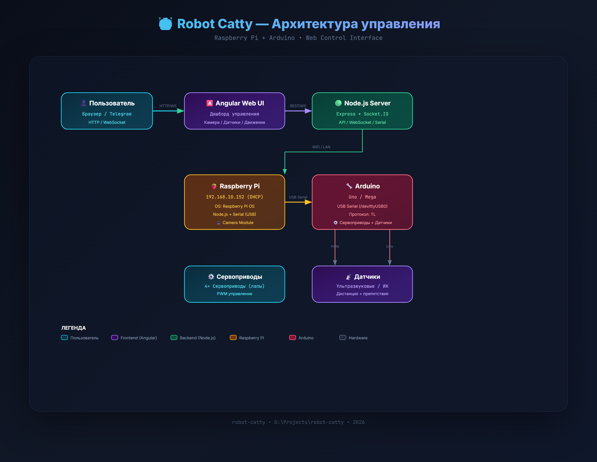

# 🤖 Robot Catty

<div align="center">


```
  ╔═══════════════════════════════════════════════════════════╗
  ║  ██████╗  ██████╗ ██████╗  ██████╗ ████████╗           ║
  ║  ██╔══██╗██╔═══██╗██╔══██╗██╔═══██╗╚══██╔══╝           ║
  ║  ██████╔╝██║   ██║██████╔╝██║   ██║   ██║              ║
  ║  ██╔══██╗██║   ██║██╔══██╗██║   ██║   ██║              ║
  ║  ██║  ██║╚██████╔╝██████╔╝╚██████╔╝   ██║              ║
  ║  ╚═╝  ╚═╝ ╚═════╝ ╚═════╝  ╚═════╝    ╚═╝              ║
  ║                                                         ║
  ║   🐱 Raspberry Pi + Arduino Robot                       ║
  ║   6 серво (голова + шея) + 4 серво (тело) + RGB LED    ║
  ║   Web UI + Telegram Bot + API                           ║
  ╚═══════════════════════════════════════════════════════════╝
```

[](https://opensource.org/licenses/MIT)
[](https://www.arduino.cc/)

</div>

Raspberry Pi + Arduino робот с веб-интерфейсом управления, Telegram ботом и REST API.

## 📑 Оглавление

- [🏗️ Архитектура](#-архитектура)
- [⚡ Подключение и питание](#-подключение-и-питание)
- [💻 Управление и API](#-управление-и-api)
- [🚀 Установка и запуск](#-установка-и-запуск)
- [📁 Структура проекта](#-структура-проекта)
- [⚠️ Известные проблемы](#-известные-проблемы)
- [📸 Галерея](#-галерея)
- [📝 Блог и лицензия](#-блог-и-лицензия)

---

## 🏗️ Архитектура



### Общая схема

```
┌─────────────────┐     USB      ┌──────────────┐
│                 │──────────────│ Arduino Uno  │ Голова: 3 серво + RGB LED
│  Raspberry Pi   │              │ (CH340)      │  • Левый глаз (D4)
│  Node.js :3000  │              │              │  • Правый глаз (D7)
│                 │              │              │  • Челюсть (D8)
│                 │              └──────────────┘
│                 │     USB      ┌──────────────┐
│                 │──────────────│ Arduino Mega │ Тело: 4 серво (+4 future)
│                 │              │ 2560 R3      │  • Shoulder L/R (D2/D3)
│                 │              │              │  • Elbow L/R (D4/D5)
│                 │              └──────────────┘
│                 │
│  Angular UI ◄── WebSocket ── Браузер
└─────────────────┘
```

### Компоненты

| Компонент | Роль | Подключение |
|-----------|------|-------------|
| Raspberry Pi 3B | Контроллер, веб-сервер | Ethernet/WiFi |
| Arduino Uno (CH340) | Голова: 3 серво + RGB LED | USB → /dev/ttyUSB0 |
| Arduino Mega 2560 R3 | Тело: 4 серво | USB → /dev/ttyACM0 |
| RGB LED (4-pin) | Индикация глаз | Uno D3/D5/D6 |
| Сервоприводы (×7+) | Движение | Uno D4,D7,D8,D9-D11 / Mega D2-D9 |

### Распиновка

#### Arduino Uno (Голова)

| Пин | Компонент | Описание |
|-----|-----------|----------|
| D3 | RGB R | Красный светодиод (через 220Ω) |
| D5 | RGB G | Зелёный светодиод (через 220Ω) |
| D6 | RGB B | Синий светодиод (через 220Ω) |
| D4 | Servo | Левый глаз ↔ |
| D7 | Servo | Правый глаз ↔ |
| D8 | Servo | Челюсть (открыть/закрыть) |
| D9 | Servo | Поворот головы ↔ |
| D10 | Servo | Шея ↕ (наклон) |
| D11 | Servo | Шея ↔ (поворот) |
| GND | RGB GND | Общий провод |

#### Arduino Mega 2560 (Тело)

| Пин | Компонент | Описание |
|-----|-----------|----------|
| D2 | Servo | Левое плечо |
| D3 | Servo | Правое плечо |
| D4 | Servo | Левый локоть |
| D5 | Servo | Правый локоть |
| D6-D9 | Servo | Резерв (future) |

> ⚠️ НЕ питать сервоприводы от Arduino 5V! Используйте отдельный блок 5-6V, минимум 2А на серво. GND всех источников соединить вместе.

### Интерактивные схемы

- 🔗 [Полная интерактивная схема](docs/robot-catty-circuit.html) — кликабельная SVG с подробными подписями
- 📄 [Wiring документация](docs/wiring.md) — полное описание подключения

---

## ⚡ Подключение и питание

### Схема подключения (превью)

| Схема подключения | Проводка |
|:---:|:---:|
|  |  |

### Питание

⚠️ **ВАЖНО**: Сервоприводы НЕ питать от Arduino 5V!

- **Arduino Uno/Mega**: питание от USB Raspberry Pi
- **Сервоприводы (7шт)**: отдельный блок питания 5-6V, минимум 2А на каждый серво
- **RGB LED**: питание от Arduino через резисторы 220Ω
- **GND**: соединить GND всех источников питания вместе

---

## 💻 Управление и API

### Serial протокол (9600 baud)

#### Arduino Uno (Голова)

| Команда | Описание | Пример |
|---------|----------|--------|
| `SERVO:<name>:<angle>` | Установить угол серво (0-180) | `SERVO:eyeL:120` |
| `RGB:<r>,<g>,<b>` | Установить цвет (0-255) | `RGB:255,128,0` |
| `OFF` | Выключить RGB | `OFF` |
| `FADE:<r>,<g>,<b>` | Плавный переход к цвету | `FADE:0,0,255` |
| `BLINK` | Режим мигания | `BLINK` |
| `PRESET:<name>` | Готовый цвет | `PRESET:red` |
| `STATUS` | Текущее состояние | `STATUS` |

#### Arduino Mega (Тело)

| Команда | Описание | Пример |
|---------|----------|--------|
| `SERVO:<name>:<angle>` | Установить угол серво (0-180) | `SERVO:shoulderL:120` |
| `CENTER` | Центрировать все серво | `CENTER` |
| `STATUS` | Текущее состояние | `STATUS` |

#### Пресеты цветов

`red`, `green`, `blue`, `white`, `yellow`, `cyan`, `magenta`, `orange`, `pink`, `purple`

### REST API

| Метод | Путь | Описание |
|-------|------|----------|
| GET | `/api/status` | Статус подключения + состояние |
| POST | `/api/servo` | `{board, servo, angle}` |
| POST | `/api/rgb` | `{r, g, b}` |
| POST | `/api/rgb/off` | Выключить RGB |
| POST | `/api/rgb/preset` | `{name}` |
| POST | `/api/animation` | `{name, params}` |
| POST | `/api/animation/stop` | Остановить анимацию |

### WebSocket

Подключение: `ws://<pi-ip>:3000`

```json
{"type": "servo", "board": "head", "servo": "eyeL", "angle": 120}
{"type": "rgb", "r": 255, "g": 0, "b": 0}
{"type": "preset", "name": "red"}
{"type": "animation", "name": "wave"}
{"type": "stop"}
```

### Веб-интерфейс

```bash
cd ~/robot-catty/server
npm start
# Открыть http://<pi-ip>:3000
```

Возможности UI:
- 🎛️ Управление серво — слайдеры для всех серво
- 💡 RGB LED — слайдеры R/G/B + 10 пресетов + кнопка выключения
- 🎬 Анимации: `wave`, `nod`, `shake`, `dance`, `lookAround`, `blink`
- 📊 Статус в реальном времени — WebSocket
- 📋 Лог — все команды и события

### Telegram бот

Управление RGB LED через Telegram.

**Команды:** `/red`, `/green`, `/blue`, `/white`, `/yellow`, `/cyan`, `/magenta`, `/orange`, `/pink`, `/purple`, `/off`, `/status`, `/blink`, `/color R G B`, `/demo`, `/stop`

> ⚠️ Токен бота нужно запросить у @BotFather и вставить в `scripts/rgb_bot.py`

---

## 🚀 Установка и запуск

### Raspberry Pi

```bash
# Клонирование
git clone https://github.com/RuslanStrogov/robot-catty.git
cd robot-catty

# Установка Node.js зависимостей
cd server
npm install

# Запуск
npm start

# Автозапуск (crontab)
crontab -e
# Добавить:
# @reboot cd /path/to/robot-catty/server && /usr/bin/node server.js
```

### Загрузка скетчей

```bash
# Arduino Uno (голова — 3 серво + RGB)
avr-gcc -mmcu=atmega328p -DF_CPU=16000000L \
  -DARDUINO=10607 -DARDUINO_AVR_UNO -DARDUINO_ARCH_AVR \
  -I$CORE -I$VAR \
  -Os -w -std=gnu++11 -fpermissive -fno-exceptions \
  -ffunction-sections -fdata-sections -fno-threadsafe-statics -flto \
  $CORE/*.cpp $CORE/*.c \
  firmware/servo_head/servo_head.cpp -o servo_head.elf -lm

avrdude -c arduino -p m328p -P /dev/ttyUSB0 -b 115200 -D -U flash:w:servo_head.hex:i

# Arduino Mega (тело)
arduino-cli compile -b arduino:avr:mega firmware/servo_body/
arduino-cli upload -b arduino:avr:mega -p /dev/ttyACM0 firmware/servo_body/
```

### Демо режим

Автоматический запуск при старте системы (crontab `@reboot`):

1. 🔴 Моргание красным — 1 минута
2. Каждый пресет — 3 минуты с плавным переходом

---

## 📁 Структура проекта

```
robot-catty/
├── firmware/
│   ├── servo_head/servo_head.cpp    # Uno — голова (3 серво + RGB)
│   └── servo_body/servo_body.ino    # Mega — тело (4 серво)
├── server/
│   ├── package.json                 # Node.js зависимости
│   ├── server.js                    # Express + WebSocket сервер
│   ├── services/
│   │   ├── arduino.js               # Serial связь с Arduino
│   │   └── robot.js                 # Логика робота + анимации
│   └── public/
│       └── index.html               # Angular веб-интерфейс
├── config/
│   ├── arduino_config.md            # Настройки плат
│   └── servo_config.json            # Конфигурация серво (пины, лимиты)
├── docs/
│   ├── wiring.md                    # Схема подключения (полная)
│   ├── interactive-schematics.md    # Описание интерактивных схем
│   ├── robot-catty-circuit.html     # Интерактивная SVG
│   └── images/                      # Фото и схемы
├── scripts/
│   ├── rgb_bot.py                   # Telegram бот управления RGB
│   └── demo.py                      # Демо-режим (автозапуск)
├── remote/
│   └── rgb_led_remote.py            # Удалённое управление с Windows
├── ISSUES.md                        # Известные задачи и проблемы
├── CREATE_ISSUES.md                 # Шаблоны для GitHub Issues
└── README.md                        # Этот файл
```

---

## ⚠️ Известные проблемы

- Arduino Uno CH340: все фюзы = 0x00 (125kHz клок), но serial работает на 9600 baud
- Для компиляции на Pi нужен Arduino IDE или PlatformIO (версия atmelavr ≤5.3.0 для корректной работы с Mega 2560)
- AVR core хранится в `/tmp/` или `~/.platformio/` — теряется после перезагрузки при использовании Snap
- Mega 2560: Servo library конфликтует с Timer1 — используйте прямую ШИМ или `Servo.h` с `lib_deps`

Подробнее в [ISSUES.md](ISSUES.md)

---

## 📸 Галерея

<div align="center">


### Прототипы интерфейса

| Прототип 1 | Прототип 2 | Прототип 3 |
|:---:|:---:|:---:|
|  |  |  |

</div>

---

## 📝 Блог и лицензия

- **Telegram**: [http://t.me/itvpi](http://t.me/itvpi)
- **VK**: [https://vk.com/itvpiska](https://vk.com/itvpiska)

## Лицензия

MIT
